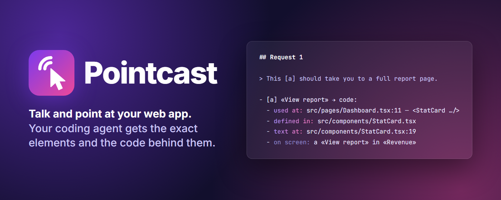

<p align="center">
  
</p>

# Pointcast

**Talk and Alt+click on your web app. Your coding agent gets the exact elements, and the lines of code behind them.**

One recording covers a whole list of UI changes: say what you want while you point, press Stop, and Claude Code, Codex, Gemini CLI or Cursor get a spec that leads with `src/…:line`. In [an evaluation on three real admin dashboards](docs/eval/results-2026-09-27.md), pointing raised the agent's accuracy from 78 % to 89 % over the same words without pointing; in a follow-up, adding the code lines [cut the tokens it spent finding the elements by more than half](docs/eval/stage0-code-pointer-2026-09-27.md). Your voice is transcribed locally, in the browser.

[](https://github.com/Hugelidus/pointcast/actions/workflows/ci.yml)
[](https://github.com/Hugelidus/pointcast/releases)
[](https://www.npmjs.com/package/pointcast)
[](LICENSE)

**[Quick start](#quick-start) · [How it works](#how-it-works) · [Eval](docs/eval/results-2026-09-27.md) · [Discussions](https://github.com/Hugelidus/pointcast/discussions) · [Changelog](CHANGELOG.md)**

> **Public beta (0.2).** Chrome and Edge on desktop, developed and tested on Windows; macOS and Linux should work but are untested. Feedback: [issues](https://github.com/Hugelidus/pointcast/issues).

## Quick start

**1. Add the extension.** The Chrome Web Store listing is in review; meanwhile, [load the release zip](#manual-install).

**2. Connect your agent** (optional: it fetches your latest recording itself and resolves each element to its line in your repository):

```bash
# Claude Code, then /pointcast
claude plugin marketplace add Hugelidus/pointcast && claude plugin install pointcast@pointcast
# Codex CLI, then in a new session $pointcast:pointcast (or "apply my latest pointcast recording")
codex plugin marketplace add Hugelidus/pointcast && codex plugin add pointcast@pointcast
# Gemini CLI, then /pointcast in a folder you trust
gemini extensions install https://github.com/Hugelidus/pointcast
# Cursor, Windsurf or any MCP client: run this MCP server (config: packages/cli/README.md#mcp-server)
npx -y pointcast@0.2 mcp
```

Any other agent: paste the spec from the clipboard. (In Windows PowerShell 5.1, run each `&&` half on its own line.)

**3. Record** on your app on `localhost`: press **Record**, talk while you **Alt+click** things, press **Stop**.

<details id="manual-install">
<summary><b>Manual install (release zip)</b>, updating from 0.1.x, and where recordings go</summary>

Download the newest `pointcast-<version>-chrome.zip` from [Releases](https://github.com/Hugelidus/pointcast/releases) and unzip it. Open `chrome://extensions` (`edge://extensions` in Edge), turn on *Developer mode*, choose *Load unpacked* and pick the unzipped folder. To build it yourself, see [CONTRIBUTING.md](CONTRIBUTING.md#try-it-locally).

**Updating an unpacked 0.1.x?** Remove it and load 0.2 as a new extension, once. From 0.2 on, every build has the same extension id (the Chrome Web Store item's), so the id changes this one time: allow the microphone again, and the speech model downloads once more.

**Where recordings go.** While your agent's `pointcast` MCP server runs (the plugins above, or `npx -y pointcast@0.2 mcp`), recordings go straight to it, with no downloads. Without it, Chrome's downloads save them to `Downloads/pointcast/`; then turn off *Ask where to save each file before downloading* (`chrome://settings/downloads`), or Chrome asks for every file and the sessions miss the folder where the plugins, the MCP server and the CLI look. The popup tells you when that happened.

**Other sites.** Pointcast runs on `localhost`, `127.0.0.1`, `[::1]`, `*.localhost` and `*.test` out of the box. For a staging server or a preview deployment, open the popup there and press **Enable on `<host>`**: Chrome asks for access to that host only.

**The CLI** (optional, Node ≥ 22.12): `npx pointcast process` re-renders the latest session with its code lines resolved in the current repository; `npx pointcast --help` lists every option.
</details>

## How it works

1. **Record.** Press Record in the extension (or Alt+Shift+S) and talk while you use your app.
2. **Point.** Alt+click or select text on whatever you are talking about. The Alt+click never reaches your app.
3. **Stop.** Your voice is transcribed on your machine, and each sentence becomes a request with the elements you pointed at while saying it:

```markdown
## Request 2

> And this [a] button should export the order status.

- [a] «Export» → code:
  - used at: `src/pages/Dashboard.tsx` — `<OrdersTable>`
  - text at: `src/components/OrdersTable.tsx:22` — `<button type="button" id="orders-export" className="btn btn-export"> Export </button>`
  - within: `<Dashboard>` in `src/App.tsx` ← `<App>` in `src/main.tsx`
  - on screen: button «Export» in «Orders» on `/`
```

(From a real recording on [examples/react-dashboard](examples/react-dashboard), spoken in Spanish and translated here; selector, DOM path and styles lines trimmed. The app has a second «Export» button, in another component: the spec names this one.)

Your agent fetches the spec through its plugin, or you paste it. On React 19, Vue 3 and Svelte 5 dev builds each element leads with its code: where that instance is used, which component defines it (marked when it is shared) and the line where its text or data lives. Other pages get the DOM description: selector, path, HTML and text.

<details>
<summary>Where the code lines come from</summary>

The component chain comes from the page. The exact lines need your source, and Pointcast reads it where it is:

- **Clipboard** (what Stop does): at Stop, the extension reads the chain's files from your page's own **Vite** dev server (`/src/…?raw`), within 2 s and in memory only; the spec keeps paths, line numbers and one source line per location. With webpack or Next.js the pasted spec has the chain but no `text at:` lines, and the popup says why.
- **MCP server and agent plugins**: the lines are resolved in your local repository, whatever the dev server. `pointcast process` does the same from the CLI.

Nothing is added when the text is written more than once: no line beats a wrong line.
</details>

## Why it helps

A coding agent can't see what "this" is in "make *this* sortable and move *this* next to *that*", and a screen recording doesn't give it the DOM element or the file behind it. In the [evaluation](docs/eval/results-2026-09-27.md), pointing helped exactly where narration alone is ambiguous: two "Export" buttons, two identical cards, a shared `Button` component. A careful, deliberately written request is still more accurate (96 %): Pointcast doesn't replace precise writing, it replaces having to write precisely while you'd rather point and talk.

## How it compares

|  | Pointcast | [MCP Pointer](https://github.com/etsd-tech/mcp-pointer) | [react-grab](https://github.com/aidenybai/react-grab) | MarkuprPlus |
|---|---|---|---|---|
| Captures | DOM element + narration | DOM element only | DOM element only | screen pixels + narration |
| Narration | yes (local Whisper) | no | no | yes |
| Multiple elements over time | yes, one spec per recording | one at a time | one at a time | tied to a screenshot |
| Source location | React 19, Vue 3, Svelte 5 dev builds: the instance and the line of its text | React fiber (experimental) | React fiber | — |
| Audio leaves your machine | no (local by default) | n/a | n/a | depends on provider |
| Works with | any framework | any | React only | any |

## Works with

| Agent | How | Apply a recording |
|---|---|---|
| Claude Code | [plugin](integrations/claude-code-plugin/README.md) | `/pointcast [session-id]` |
| Codex CLI | plugin (the same one) | `$pointcast:pointcast [session-id]`, or ask to "apply my latest pointcast recording" |
| Gemini CLI | extension | `/pointcast [session-id]` |
| Cursor, Windsurf | [MCP server](packages/cli/README.md#mcp-server) | ask for your latest pointcast recording |
| Any other agent | the clipboard | paste |

Browsers: Chrome and Microsoft Edge. Brave, Opera, Vivaldi and Arc are Chromium too and load the same extension, but are untested. Firefox is not supported yet.

## Privacy

- **Local-first.** Audio and transcription stay on your machine by default (Whisper in the browser, via transformers.js). No account, no server, no API key. Besides the model download and your dev server, the extension only talks to your own `pointcast` MCP server on `127.0.0.1`, which accepts recordings from the Pointcast extension only.
- **Off by default everywhere but local dev hosts.** Any other site needs an explicit, per-host opt-in; the extension never asks for "all sites".
- **Sensitive fields are never captured**: password fields, `autocomplete=current-password|new-password|one-time-code|cc-*`, or anything marked `data-sensitive`. On a site you've enabled, text that looks like personal data is redacted too.
- **Allowlist, not blocklist.** Only a fixed set of HTML attributes is ever captured.
- **A plain click is never captured.** Only Alt+click and text selection are; every other click reaches your app as if the extension weren't there.

Privacy policy: [PRIVACY.md](PRIVACY.md). Rationale and the canary test that verifies it: [docs/decisions.md](docs/decisions.md#d8-privacy). Security problems: report them privately ([SECURITY.md](SECURITY.md)).

## FAQ

**Does this send my voice anywhere?** No, by default. A local Whisper model (`Xenova/whisper-base`, 294 MB, downloaded once, so the first recording takes longer) runs in the browser. The CLI's optional `--engine openai` sends audio to an OpenAI-compatible endpoint only if you choose it.

**What if I point at the wrong element?** Popup → **Undo last gesture**, or **Alt+Shift+U**.

**How accurate is the transcription?** ~93 % word accuracy on Spanish test recordings ([D1](docs/decisions.md#d1-transcription--whisper-via-transformersjs-locally)).

**Is this affiliated with Anthropic, OpenAI, Google, Cursor or any agent vendor?** No. Pointcast is an independent, MIT-licensed tool.

<details id="known-limitations-of-the-beta">
<summary><b>Known limitations of the beta</b></summary>

- **Chromium browsers only**, desktop.
- **The code pointer needs a dev build** of React, Vue 3 or Svelte 5. Production builds, Angular and other frameworks get the DOM description only.
- **Show in folder** works only for recordings Chrome's downloads saved; for one your MCP server stored, the popup names its folder instead.
- **Shared multi-user computers:** another user could send recordings to your running MCP server, or receive yours while it is down. There, turn off *Send to a running pointcast MCP server* in the popup's Settings and start the server with `--no-handoff`.
- **Port forwards:** a forward of local port 20547 (`ssh -L`, or an editor's automatic port forwarding) sends your recordings to the MCP server on the other machine, which is how to use one on a remote dev server; on a shared host it can be another user's. See the [CLI's README](packages/cli/README.md#receiving-recordings-from-the-extension).
</details>

## Roadmap

Now 0.2: recordings go straight to a running MCP server; Claude Code, Codex and Gemini CLI integrations; Edge. Next: code lines from more dev servers (webpack, Next.js) and frameworks (Angular), readable GitHub issues from a recording, store listings, Firefox. Pick one up: [help wanted](https://github.com/Hugelidus/pointcast/issues?q=is%3Aissue+is%3Aopen+label%3A%22help+wanted%22). Considered and why: [docs/ideas.md](docs/ideas.md); design decisions: [docs/decisions.md](docs/decisions.md).

## Contributing

Bug reports, ideas and PRs are welcome: build and run it from source with [CONTRIBUTING.md](CONTRIBUTING.md). Questions and ideas: [Discussions](https://github.com/Hugelidus/pointcast/discussions). Please follow the [code of conduct](CODE_OF_CONDUCT.md).

## License

[MIT](LICENSE)
